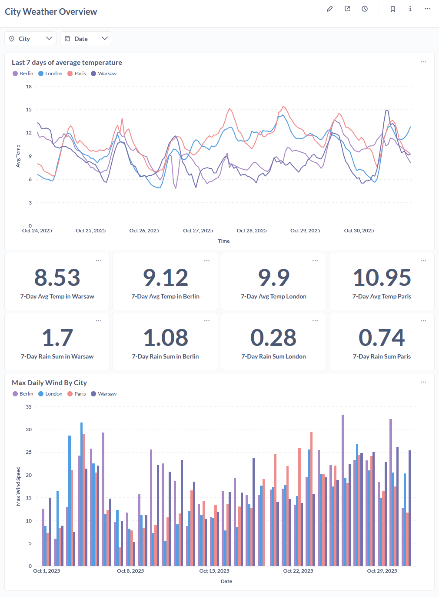

# :bar_chart: Weather Analytics Dashboard

## Overview

The Metabase dashboard provides interactive, self-service analytics for exploring weather patterns across multiple European cities. Built on top of dbt-transformed dimensional models, it delivers real-time insights with filtering and drill-down capabilities.

---

## :chart_with_upwards_trend: Dashboard Preview

<div class="dashboard-preview" markdown="1">



</div>

---

## :sparkles: Key Features

<div class="feature-grid" markdown="1">

<div class="feature-card" markdown="1">
<div class="feature-icon">📈</div>

### **Time-Series Visualization**
Track temperature trends over time with line charts showing min, max, and average daily temperatures for each city.
</div>

<div class="feature-card" markdown="1">
<div class="feature-icon">🔍</div>

### **Interactive Filters**
Filter by date range and city to focus on specific time periods or locations. Results update instantly.
</div>

<div class="feature-card" markdown="1">
<div class="feature-icon">🌍</div>

### **Multi-City Comparison**
Compare weather patterns across Warsaw, Berlin, Paris, and London simultaneously on a single view.
</div>

<div class="feature-card" markdown="1">
<div class="feature-icon">📋</div>

### **Detailed Data Table**
Access granular daily statistics with sortable columns for deeper analysis and data validation.
</div>

</div>

---

## :hammer_and_wrench: Technical Implementation

### Data Source

The dashboard queries the `fct_city_day` dimensional model created by dbt:

```sql
-- Simplified view of the underlying data model
SELECT 
    city,
    date,
    temperature_avg,
    temperature_min,
    temperature_max,
    precipitation_sum,
    wind_speed_max
FROM analytics.fct_city_day
WHERE date >= CURRENT_DATE - INTERVAL '30 days'
ORDER BY date DESC, city;
```

### Performance Optimization

- **Pre-aggregated data**: Daily aggregations computed once by dbt, not on every query
- **Indexed columns**: Database indexes on `city` and `date` for fast filtering
- **Materialized tables**: dbt materializes marts as tables, not views
- **Query caching**: Metabase caches results for improved response times

---

## :gear: Dashboard Configuration

### Metrics Displayed

| Metric | Calculation | Purpose |
|--------|-------------|---------|
| **Avg Temperature** | `AVG(temperature_2m)` | Central tendency of daily temps |
| **Min Temperature** | `MIN(temperature_2m)` | Daily low for cold analysis |
| **Max Temperature** | `MAX(temperature_2m)` | Daily high for heat analysis |
| **Total Precipitation** | `SUM(precipitation)` | Daily rainfall accumulation |
| **Max Wind Speed** | `MAX(wind_speed_10m)` | Peak wind conditions |

### Filter Options

- **Date Range**: Select custom start and end dates
- **City**: Choose one or more cities (Warsaw, Berlin, Paris, London)
- **Time Granularity**: Daily aggregations (can be extended to hourly)

---

## :rocket: Setting Up the Dashboard

### 1. Access Metabase

Navigate to [http://localhost:3000](http://localhost:3000) after running the Docker stack.

### 2. Connect to Database

**PostgreSQL Connection Settings:**
```
Host: postgres
Port: 5432
Database: analytics
Username: analytics
Password: <your_password>
```

### 3. Create Visualizations

!!! tip "Dashboard Creation"
    1. Click **New** → **Question**
    2. Select the `fct_city_day` table
    3. Choose visualization type (line chart, table, etc.)
    4. Add filters for interactivity
    5. Save to dashboard

### 4. Share & Embed

Metabase supports:

- **Public links** for sharing outside the platform
- **Embedded dashboards** in web applications
- **Scheduled email reports** for stakeholders
- **Slack/Teams integration** for alerts

---

## :bulb: Potential Extensions

<div class="feature-grid" markdown="1">

<div class="feature-card" markdown="1">
### Anomaly Detection
Add alerts for temperature extremes or unusual patterns using Metabase's alerting features.
</div>

<div class="feature-card" markdown="1">
### Forecasting Models
Integrate ML predictions alongside historical data for predictive analytics.
</div>

<div class="feature-card" markdown="1">
### Additional Cities
Extend coverage to more European or global cities by updating the ingestion pipeline.
</div>

<div class="feature-card" markdown="1">
### Hourly Granularity
Create hourly dashboards for intraday analysis using the staging tables directly.
</div>

</div>

---

[Back to Home](index.md){ .custom-btn }